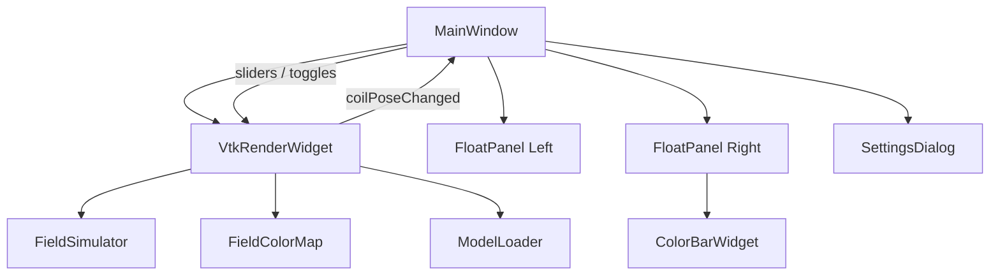

# CTM Viewer 技术说明文档

本文档是 **CTM Viewer** 的完整技术参考，涵盖架构设计、模块实现、数据格式、渲染管线、电场算法、UI 体系、构建部署及扩展指南。适合需要深入维护或二次开发的工程师阅读。

相关文档：

- 快速上手：[ONBOARDING.md](./ONBOARDING.md)
- 单元测试：[TESTING.md](./TESTING.md)

---

## 1. 系统概述

### 1.1 产品定位

CTM Viewer 是一款基于 **Qt 5 + VTK 8.0** 的 Windows 桌面三维查看器，核心场景为：

- 显示 MNI 空间脑模、头皮与八字拍线圈；
- 根据预计算电场样本，实时对脑模顶点做着色仿真；
- 支持线圈 6-DOF 调节、刺激强度缩放、LUT 范围、主题切换等交互。

### 1.2 技术栈

| 层级 | 技术 |
|------|------|
| UI 框架 | Qt 5.15 Widgets |
| 3D 渲染 | VTK 8.0 OpenGL（Win32 原生窗口） |
| 网格 I/O | OpenCTM（.ctm）、VTK OBJ Reader（.obj） |
| 语言标准 | C++17 |
| 构建 | CMake 3.16+ |
| 测试 | Qt Test + CTest |

### 1.3 与上游项目关系

```
aimQ-Frontend                magaim-qt
     │                            │
     │ b9076EField.js             │ ModelLoader, VTK 嵌入
     ▼                            ▼
convert_efield.js ──► b9076_efield.bin    CTM Viewer
                           │                    │
                           └──── FieldSimulator ┘
```

| 能力 | 上游参考路径（示例） |
|------|----------------------|
| 电场数据 | `aimQ-Frontend/.../b9076EField.js` |
| CTM 加载 | `magaim-qt/loader/modelloader.cpp` |
| VTK 交互 | `magaim-qt/vtk/vtkitem.cpp` |
| 着色思路 | aimQ `setColor` 连续色标逻辑 |

---

## 2. 总体架构

### 2.1 分层结构

```
┌─────────────────────────────────────────────────────────┐
│                    Presentation (Qt)                       │
│  MainWindow · FloatPanel · ColorBarWidget · SettingsDialog│
├─────────────────────────────────────────────────────────┤
│                    Rendering (VTK)                       │
│  VtkRenderWidget · vtkWin32OpenGLRenderWindow            │
├─────────────────────────────────────────────────────────┤
│                    Domain / Simulation                   │
│  FieldSimulator · FieldColorMap · ModelLoader            │
├─────────────────────────────────────────────────────────┤
│                    Resources                             │
│  assets/models · assets/data · Qt resources (icon)       │
└─────────────────────────────────────────────────────────┘
```

### 2.2 进程内对象关系



### 2.3 启动时序

1. `main.cpp` 创建 `QApplication`，设置 Fusion 样式、应用图标 `:/icon.ico`；
2. `MainWindow` 构造 → `setupUi()` 创建 `VtkRenderWidget` 与左右浮层；
3. `loadDefaultSimulation()` 调用 `VtkRenderWidget::loadSimulationScene(assetsRoot)`；
4. `showEvent` 触发 `initializeVtk()`，创建 Win32 渲染窗口并嵌入 Qt Widget；
5. 加载电场 bin、三个 CTM 模型，创建 Actor，捕获初始相机位姿；
6. 默认开启电场仿真，线圈模型隐藏、显示坐标轴替代。

---

## 3. 目录与模块详解

### 3.1 `src/main.cpp`

- 启用 `Qt::AA_EnableHighDpiScaling`（Qt 5 高 DPI）；
- 从 Qt 资源加载 `icon.ico`；
- 实例化 `MainWindow` 并进入事件循环。

### 3.2 `MainWindow`

**职责：** 应用壳层、控件布局、主题应用、快捷键、状态栏。

**布局：**

```
QHBoxLayout
├── FloatPanel (左, 可折叠)
├── VtkRenderWidget (中央 3D 视口, stretch=1)
└── FloatPanel (右, 色标 + LUT)
QStatusBar
```

**关键状态：**

| 成员 | 说明 |
|------|------|
| `m_currentTheme` | 当前 `AppTheme::ThemeId` |
| `m_lutMinSpin` / `m_lutMaxSpin` | LUT 上下限，默认 40 / 150 |
| 线圈滑条 ×6 | 与 `VtkRenderWidget::CoilPose` 同步 |

**资源路径解析 `assetsRoot()`：**

1. 优先 `applicationDirPath()/assets`（Release 输出旁）；
2. 否则回退 `../../assets`（开发树相对路径）。

**LUT 校验：** `onLutMinChanged` / `onLutMaxChanged` 保证 `min < max`，最小间隔 1 V/m。

### 3.3 `VtkRenderWidget`

**职责：** VTK 场景管理、交互、线圈位姿、漫游、FPS、透明度、场着色调度。

#### 3.3.1 Qt + VTK Win32 嵌入

这是本项目最关键的技术点之一。未使用 `QVTKOpenGLWidget`（VTK 8 在 Qt5 下的高版本封装），而采用 **Win32 子窗口**方案：

```cpp
setAttribute(Qt::WA_NativeWindow);
setAttribute(Qt::WA_PaintOnScreen);
setAttribute(Qt::WA_NoSystemBackground);
paintEngine() const override { return nullptr; }

m_renderWindow = vtkWin32OpenGLRenderWindow::New();
m_renderWindow->SetParentId(reinterpret_cast<void *>(winId()));
```

**原因：** 早期集成中 `QOpenGLWidget` FBO 方案导致模型不可见；Win32 直嵌渲染窗口可稳定显示。

**约束：**

- VTK 渲染区域独占原生 HWND，**无法在 3D 视口上方叠加 Qt 子控件**；
- UI 必须放在视口左右（FloatPanel），而非悬浮在画面之上。

#### 3.3.2 交互配置

| 参数 | 值 | 说明 |
|------|-----|------|
| `DesiredUpdateRate` | 0.0001 | 避免旋转时 LOD 降低导致“橡皮泥”变形感 |
| `MotionFactor` | 4.0 | 提高鼠标旋转灵敏度 |
| 交互样式 | `vtkInteractorStyleTrackballCamera` | 轨迹球相机 |

鼠标事件转发至 `vtkRenderWindowInteractor` 的 `InvokeEvent` 链。

#### 3.3.3 场景对象

| Actor | 模型 | 默认 | 说明 |
|-------|------|------|------|
| `m_headActor` | head.ctm | 半透明 55% | 启用 polygon offset 避免与脑模 Z-fighting |
| `m_brainActor` | brain_mask.ctm | 不透明 | 顶点颜色由场仿真驱动 |
| `m_coilActor` | coil_b090c.ctm | 隐藏 | 浅蓝色 Phong 材质 |
| `m_coilAxes` | vtkAxesActor | 显示 | 线圈隐藏时用 30mm 坐标轴表示位姿 |
| `m_userActor` | 用户打开模型 | - | 附加加载的 CTM/OBJ |

#### 3.3.4 透明度与深度

`setupTransparencyRendering()`：

- `SetAlphaBitPlanes(1)`
- `SetUseDepthPeeling(1)`，`MaximumNumberOfPeels(64)`

头皮半透明时启用深度剥离，减少破碎感。脑模使用 `SetResolveCoincidentTopologyToPolygonOffset()`。

#### 3.3.5 线圈位姿

`CoilPose` 结构：

```cpp
struct CoilPose {
    double x, y, z;      // 平移 mm
    double rx, ry, rz;   // 旋转 度
};
```

默认：`z=120, rx=-20`，其余为 0。

`updateCoilMatrix()` 将欧拉角转为 `vtkTransform`，应用到线圈 Actor 与坐标轴。

#### 3.3.6 漫游模式

- `computeRoamBounds()` 根据头模包围盒加 padding 得到随机范围；
- `m_roamTimer` 40ms  tick，`smoothStep` 插值当前与目标位姿；
- 每轮进度完成后 `pickRoamTarget()` 重新采样；
- 开启漫游时 `MainWindow` 禁用线圈滑条。

#### 3.3.7 相机复位

`captureInitialCamera()` 在场景加载完成后保存相机；
`resetCamera()` 恢复该快照，**不是** VTK 的 `ResetCamera()`（后者会重新 fit 包围盒）。

#### 3.3.8 场着色调度

- 线圈移动时 `scheduleFieldUpdate()` 启动 40ms 防抖定时器；
- `updateFieldColors()` 调用 `FieldSimulator::applyToBrain`；
- 更新后 `m_brainActor->Modified()` + `requestRender()`。

### 3.4 `FieldSimulator`

**职责：** 加载预计算电场样本，将线圈世界坐标变换到场局部空间，对脑顶点做 IDW 插值并映射颜色。

#### 3.4.1 二进制格式

| 偏移 | 类型 | 字段 |
|------|------|------|
| 0 | uint32 LE | `sampleCount` |
| 4 | float×4 × N | `x, y, z, magnitude` |

每个样本 16 字节。由 `scripts/convert_efield.js` 从 aimQ JS 数组生成。

#### 3.4.2 坐标变换

样本存储坐标 `(x, y, z)` 经 `fieldLocalPosition` 映射为场空间 mm：

```cpp
return { sample.x * 10.0, sample.z * 10.0, sample.y * 10.0 };
```

即 **轴重排 + ×10 单位换算**，与 aimQ 前端保持一致。

脑顶点世界坐标经线圈变换的**逆矩阵**映射到场空间：

```cpp
fieldTransform->SetMatrix(coilMatrix);
fieldTransform->RotateZ(90.0);
inverse->Invert();
fieldVertex = inverse * brainVertex;
```

#### 3.4.3 空间网格加速

- 网格步长 `kGridSize = 10.0` mm；
- `buildGrid()` 将样本按 floor(pos/10) 放入 `unordered_map<string, vector<GridPoint>>`；
- 查询时检查当前格及相邻 7 格（2×2×2 邻域）。

#### 3.4.4 IDW 插值

对邻域内每个样本点：

```cpp
weight = 1.0 / (distance² + 4.0)
magnitudeSum += magnitude * weight
weightSum += weight
mappedValue = (magnitudeSum / weightSum) * (intensityPercent / 100.0)
```

- `+4.0` 避免除零并平滑近场；
- 最大搜索距离 `kGridSize * sqrt(3)`；
- 无有效样本时顶点着脑灰。

#### 3.4.5 线圈距离检查

`isCoilWithinRange()` 检查线圈平移量模长是否 ≤ 200mm，可用于上游逻辑扩展。

### 3.5 `FieldColorMap`

**职责：** 将场强标量映射为 RGB 顶点色。

#### 3.5.1 脑灰常量

```cpp
static constexpr double kBrainGray = 0.58;  // → RGB(148,148,148)
```

低于 LUT 下限的值着脑灰，使低场强区域保持“未着色脑模”外观。

#### 3.5.2 热力图色带

分段线性插值，控制点（归一化 t → RGB）：

| t | 颜色 | 说明 |
|---|------|------|
| 0.00 | #949494 | 脑灰 |
| 0.16 | #5C8FD6 | 蓝 |
| 0.34 | #0088FF | 亮蓝 |
| 0.52 | #00E5FF | 青 |
| 0.70 | #B8FF40 | 黄绿 |
| 0.86 | #FFFF00 | 黄 |
| 1.00 | #FF2200 | 红 |

`colorForValue(value)`：

```cpp
if (value <= minValue) → brainGray
t = clamp((value - min) / (max - min), 0, 1)
colorForNormalized(t) → sampleHeatMap
```

### 3.6 `ModelLoader`

**职责：** 统一加载 CTM / OBJ 为 `vtkPolyData`。

| 格式 | 实现 |
|------|------|
| `.ctm` | OpenCTM `ctmLoadCustom` + 手动填充 `vtkPoints` / `vtkCellArray` |
| `.obj` | `vtkOBJReader` |

支持可选法线、UV。加载失败通过 `errorMessage` 返回中文描述。

### 3.7 UI 组件

#### `FloatPanel`

- 左右可折叠浮层，折叠后显示 44px 竖条（`collapsedRailTitle` + 展开按钮）；
- `contentLayout()` 供 `MainWindow` 填充控件。

#### `ColorBarWidget`

- `paintEvent` 绘制竖向渐变条；
- `setRange(min, max)` 更新旁注数值，与 LUT SpinBox 同步。

#### `SettingsDialog`

- 无边框圆角弹框，`AppTheme::settingsDialogStylesheet` 随预览主题变化；
- 2×2 主题卡片，选中后点「完成」应用。

#### `AppTheme.h`

四套主题：`Light` 晨曦白、`Dark` 深空夜、`Ocean` 海洋蓝、`Mint` 薄荷绿。

提供：

- `stylesheet()` — 主窗口 QSS；
- `viewportColors()` — VTK 渐变背景 RGB；
- `settingsDialogStylesheet()` — 设置弹框 QSS；
- `themeAccent()` / `themeSwatchGradient()` — 卡片预览。

---

## 4. 资源与部署

### 4.1 `assets/` 目录

| 路径 | 说明 |
|------|------|
| `data/b9076_efield.bin` | 八字拍电场样本 |
| `models/head.ctm` | 头皮 |
| `models/brain_mask.ctm` | 脑 mask |
| `models/coil_b090c.ctm` | 线圈 |
| `icon.ico` | 应用图标 |

POST_BUILD 自动复制整个 `assets/` 到 exe 目录。

### 4.2 Qt 资源 `resources/app.qrc`

嵌入 `icon.ico` 供 `QIcon(":/icon.ico")` 使用。

### 4.3 Windows 可执行图标 `resources/app.rc`

将同一图标嵌入 PE 文件，资源 ID 为 `IDI_ICON1`。

### 4.4 打包 `scripts/package.ps1`

流程：

1. CMake Release 构建；
2. 复制 exe、assets、openctm.dll、全部 VTK dll；
3. `windeployqt` 收集 Qt 平台插件与 DLL；
4. 输出 `dist/ctm-viewer-1.0.0-win64.zip`。

---

## 5. 构建系统

### 5.1 CMake 关键变量

| 变量 | 默认 | 说明 |
|------|------|------|
| `MAGIMAIM_QT_ROOT` | `D:/2025WorkSpace/magaim-qt` | 第三方库根 |
| `VTK_ROOT` | `{ROOT}/3dLib/VTK64` | VTK 安装 |
| `OPENCTM_DIR` | `{ROOT}/3dLib/openctm` | OpenCTM |
| `BUILD_TESTING` | ON | 是否构建测试 |

### 5.2 链接的 VTK 模块

见 `CMakeLists.txt` 中 `CTM_VIEWER_VTK_LIBS`（Rendering、Interaction、IO、Filters、Common 等）。**不要**随意增删模块，需与 VTK64 预编译包一致。

### 5.3 MSVC 选项

`/utf-8` 保证源文件与执行字符集为 UTF-8，避免中文路径/字符串乱码。

---

## 6. 信号与数据流

### 6.1 线圈调节

```
User moves coil slider
  → MainWindow::syncCoilPose()
  → VtkRenderWidget::setCoilPose()
  → updateCoilMatrix() + scheduleFieldUpdate()
  → FieldSimulator::applyToBrain()
  → vtkUnsignedCharArray on brain PolyData
  → render
```

### 6.2 漫游驱动

```
roamTimer timeout
  → stepRoamAnimation()
  → applyCoilPose()
  → coilPoseChanged signal
  → MainWindow::onCoilPoseFromViewer() updates sliders
```

### 6.3 LUT 变更

```
SpinBox valueChanged
  → MainWindow::applyLutRange()
  → VtkRenderWidget::setLutRange()
  → FieldColorMap::setRange()
  → ColorBarWidget::setRange()
  → updateFieldColors()
```

---

## 7. 性能考量

| 项目 | 策略 |
|------|------|
| 场更新 | 40ms 防抖，避免滑条拖动时每帧全脑重算 |
| 渲染 | 16ms 合并 `requestRender()` |
| 网格索引 | 10mm 桶 + 8 邻格，避免全表扫描 |
| 深度剥离 | 有透明度时启用，Peel 上限 64 |
| FPS 显示 | 400ms 窗口统计，降低文本更新频率 |

脑模顶点数约数万级，当前 IDW 实现在中端 CPU 上可维持交互流畅。若需进一步优化，可考虑：

- OpenMP 并行顶点循环；
- 将场样本预烘焙为 3D 纹理；
- 降低更新频率或仅在滑条 release 时重算。

---

## 8. 已知限制

1. **仅 Windows**：`vtkWin32OpenGLRenderWindow` 绑定 Win32 API；
2. **UI 无法覆盖视口**：原生 HWND 限制；
3. **VTK 8.0 锁定**：与 magaim-qt 二进制配套，升级需全量替换 DLL；
4. **电场数据固定**：当前仅内置 B090C / B9076 预计算场；
5. **无网络/数据库**：纯本地桌面应用；
6. **自动化 GUI 测试缺失**：依赖单元测试 + 人工冒烟。

---

## 9. 扩展指南

### 9.1 新增线圈型号

1. 准备新线圈 CTM 放入 `assets/models/`；
2. 生成对应电场 bin（格式同 §3.4.1）；
3. 修改 `VtkRenderWidget::loadSimulationScene` 路径；
4. 校验 `fieldLocalPosition` 与线圈坐标系约定是否一致。

### 9.2 调整色标

修改 `FieldColorMap::sampleHeatMap` 中 `stops[]` 数组；同步更新 `ColorBarWidget::paintEvent` 渐变以保持一致。

### 9.3 新增主题

1. 在 `AppTheme::ThemeId` 添加枚举；
2. 补全 `availableThemes`、`stylesheet`、`viewportColors`、`settingsDialogStylesheet`；
3. `SettingsDialog` 网格布局增加卡片。

### 9.4 支持新模型格式

在 `ModelLoader::loadModel` 增加分支，输出统一为 `vtkPolyData`。

---

## 10. 调试技巧

| 问题 | 排查 |
|------|------|
| 模型不显示 | 确认 `initializeVtk` 已执行、`winId()` 有效 |
| 颜色全灰 | 检查电场 bin 是否加载、`m_simulationEnabled`、线圈位姿 |
| 透明破碎 | 深度剥离是否启用、opacity 是否 < 1 |
| 旋转变形 | `DesiredUpdateRate` 是否被改大 |
| 中文乱码 | MSVC `/utf-8`、源文件 UTF-8 保存 |

可在 `FieldSimulator::applyToBrain` 临时输出 `weightSum` 统计诊断插值是否命中样本。

---

## 11. 版本与许可

- 应用版本：`CMakeLists.txt` 中 `project(ctm-viewer VERSION 1.0.0)`；
- 第三方依赖：Qt（LGPL/Commercial）、VTK（BSD）、OpenCTM（LGPL）——分发时请遵循各自许可。

---

## 12. 术语表

| 术语 | 含义 |
|------|------|
| LUT | Look-Up Table，此处指场强色标上下限 |
| IDW | Inverse Distance Weighting，反距离加权插值 |
| 八字拍 | YRD-B9076 经颅磁刺激设备配套线圈形态 |
| CTM | OpenCTM 压缩三角网格格式 |
| 6-DOF | 六自由度：3 平移 + 3 旋转 |
